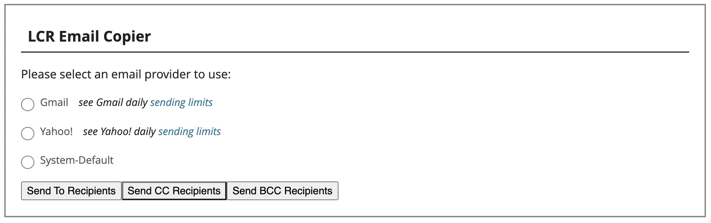

# LCR Email Copier

The current LCR functionality to send a message doesn't work for certain email providers
on [The Church of Jesus Christ of Latter-day Saints](https://lcr.churchofjesuschrist.org/messaging)
website. This chrome extension adds buttons to the LCR website allowing users to use an external
email provider to send the message once the email address and subject fields are filled in.

NOTE: This extension is not in any way affiliated or developed by the church, I am only open-sourcing
this tool so that others can use it for their callings.

# Installation

1. Download the repository as a zip and unzip it on your computer.

2. Go to [chrome://extensions](chrome://extensions) in your chrome browser.

3. Enable developer mode. After doing this, you'll see 3 additional buttons ("Load Unpacked", "Pack extension", and "Update").

4. Click "Load Unpacked" and select the "source" folder from the unzipped lcr-email-copier folder on your computer.

5. Ensure that the LCR Email Address Copier extension is enabled with the slider slid to the right.

Congratulations 🎉! The extension is now installed and can be used whenever you are trying to
[send a message](https://lcr.churchofjesuschrist.org/messaging) on the church website.

# Usage

1. Go to the [Send A Message](https://lcr.churchofjesuschrist.org/messaging) application on LCR.

2. Select all the email addresses you want to send a message to.

3. Optionally fill out the subject line.

4. Scroll to the bottom of the page and select an email provider from the list

5. Click Send To/CC/BCC Recipients. This will open a new window with a composition page to send
an email to all the recipients.

NOTE: This tool was only created for the LCR "Send a Message" function and will only display the
additional buttons on that page. If the church updates the website and this no longer works, please
file an issue to fix the extension.

# Troubleshooting

1. I don't see the email provider list or the Send buttons at the bottom of the page.

Go to chrome://extensions and ensure that the extension is installed and enabled. Click on the
Errors to see if there are any.

2. My email provider isn't listed.

The initial implementation only shows Yahoo, Gmail, and the System-Default. The system default can
be configured to use a different email provider or application. See [Mac](https://support.apple.com/en-us/HT201607#:~:text=Change%20the%20default%20email%20app&text=From%20the%20menu%20bar%2C%20choose,the%20file%20dialog%20that%20opens.) and [Windows](https://support.microsoft.com/en-us/topic/how-to-change-default-email-client-145420b1-8a02-7fbc-3d8d-176c7d248b9e) instructions.
